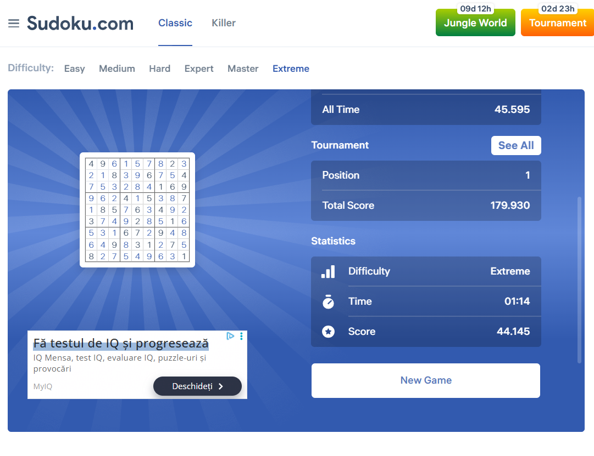

# Sudoku Solver 

A Python project that automatically solves Sudoku puzzles using the backtracking algorithm.  
The project includes two modes: `rows_col.py` (console-based solver) and `autogui.py` (automatically writes the solution into an external application).  

Demo:  
  

Link to project: [https://github.com/Rebyoo13/sudoku-solver](https://github.com/Rebyoo13/sudoku-solver)

---

## How It's Made
- Backtracking algorithm for solving Sudoku puzzles.  
- The `possible(x, y, n)` function checks Sudoku rules (row, column, 3x3 square).  
- `rows_col.py` displays the solution in the console.  
- `autogui.py` automatically inputs the solution using **PyAutoGUI**.
---

## Usage

### 1. Console Mode
```bash
python rows_col.py
````

* Enter each row of the Sudoku puzzle as a 9-digit number.
* Use 0 for empty cells.
* Example for a row:

```
040000000
```

* After entering all 9 rows, the script will compute and display the solution in the console.

### 2. Automatic Input Mode

```bash
python autogui.py
```

* Open Sudoku.com or any other Sudoku application where you want to input the solution.
* Enter each row one by one (e.g., 040000000).
* Make sure the top-left cell is selected (cursor active).
* After all 9 rows, the script will solve the puzzle and automatically input the solution into the application by simulating key presses and navigating between cells.
> Warning: Do not use the mouse or keyboard while `autogui.py` is running, or the automation may fail.
---

## Lessons Learned

* Understanding and implementing the backtracking algorithm.
* Automating keyboard and mouse actions using PyAutoGUI.
* Structuring a Python project and creating a clear, professional README.

````
