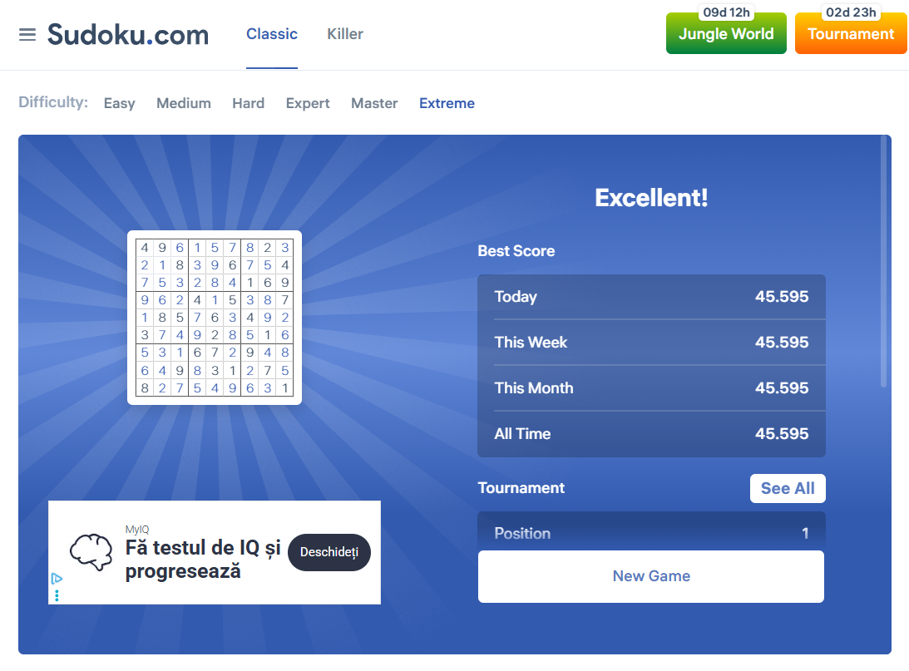

# Sudoku Solver 🧩

Proiect Python care rezolva automat Sudoku folosind backtracking.  
Include doua variante:  

- `rows_col.py` → rezolva si afiseaza solutia in consola.  
- `autogui.py` → scrie automat solutia intr-o aplicatie externa folosind PyAutoGUI.  

---

## Table of Contents
- [Demo](#demo)
- [Built With](#built-with)
- [Getting Started](#getting-started)
  - [Prerequisites](#prerequisites)
  - [Installation](#installation)
- [Usage](#usage)
- [How It’s Made](#how-its-made)
- [Lessons Learned](#lessons-learned)
- [Contact](#contact)

---

## Demo
  
  
  

---

## Built With
- Python 3  
- [PyAutoGUI](https://pyautogui.readthedocs.io/)  

---

## Getting Started

### Prerequisites
Ai nevoie de Python 3 si pachetul PyAutoGUI:
```bash
pip install pyautogui


